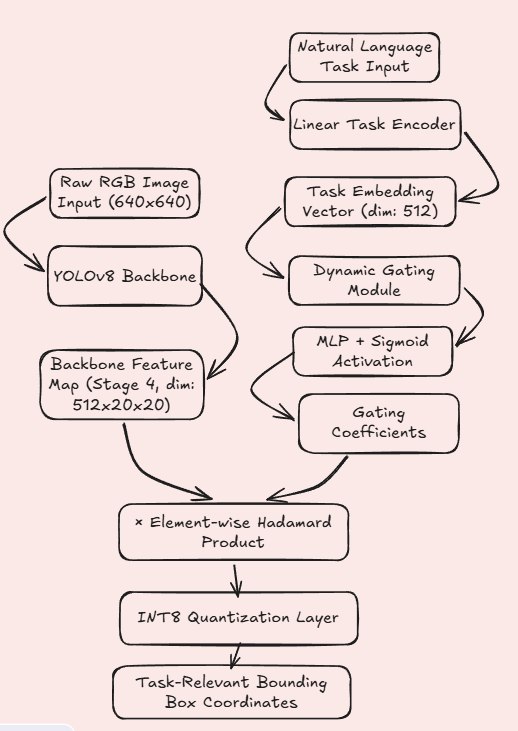
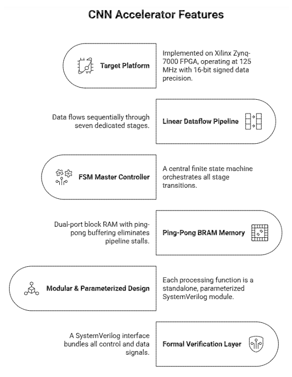
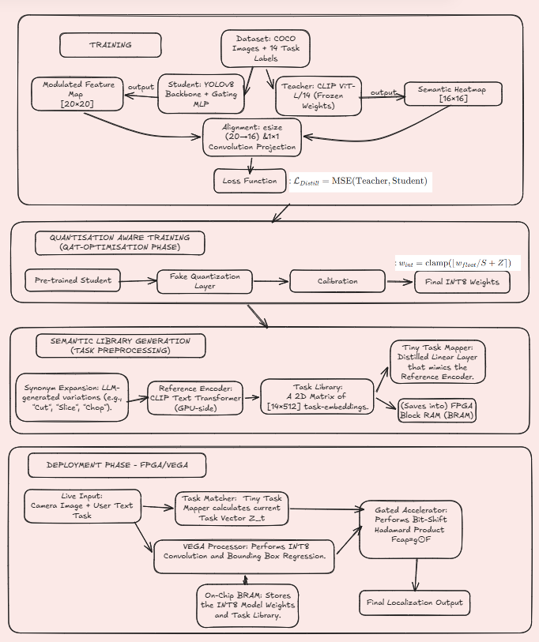

# Task-Based Object Detection

A task-conditioned object detection system that adapts object detection features according to a specified functional task, using **YOLOv8, CLIP-based knowledge distillation, semantic task embeddings, and dynamic feature gating**.

## Problem Statement

Conventional object detectors identify objects present in an image but treat all detected objects/features equally.

This project explores **task-based object detection**, where the model adapts its visual representation according to the task being performed.

For example, given the same image:

```text
Task: Pouring
→ Focus on objects/features relevant to pouring

Task: Sitting
→ Focus on objects/features relevant to sitting
```

The goal is to build a lightweight task-conditioned detector that can retain the capabilities of a general object detector while adapting its internal representation to the requested task.

---

## Methodology

The proposed system combines a **YOLOv8-Small student model** with a **CLIP ViT-B/32 teacher**.

### Overall Architecture



The task description is converted into a compact semantic representation and used to condition intermediate YOLO features.

### Task Conditioning



The task is represented using a lightweight embedding network:

```text
Task ID
   ↓
Embedding
   ↓
Linear + ReLU
   ↓
Linear + LayerNorm
   ↓
512-D Task Vector
```

The task vector is passed through an MLP to generate channel-wise gates:

```text
Task Vector
     ↓
   MLP
     ↓
  Sigmoid
     ↓
Channel Gates
     ↓
Visual Features ⊙ Gates
```

The resulting gates dynamically amplify or suppress feature channels depending on the requested task.

### Knowledge Distillation

CLIP ViT-B/32 acts as the teacher during training.

```text
             Image
               │
               ▼
          CLIP Teacher
               │
               ├── Image Features
               │
Task ──────────┤
               │
               ▼
       Semantic Heatmap
               │
               ▼
       Distillation Loss
               ▲
               │
       Student YOLO Features
```

The student learns task-relevant representations from the teacher using a combination of:

* MSE loss
* Cosine similarity loss
* YOLO detection loss
* Sparsity regularization

### Complete Training Pipeline



The final pipeline combines object detection and semantic distillation while keeping the task-conditioning module lightweight.

---

## Key Features

* **YOLOv8-Small** based object detection
* Task-specific feature conditioning
* Lightweight **512-dimensional task embeddings**
* Dynamic channel-wise feature gating
* **CLIP ViT-B/32** knowledge distillation
* Semantic heatmap distillation
* Sparsity-aware training
* INT8 / quantization-aware optimization experiments
* Streamlit-based demonstration interface

---

## Technologies

**Deep Learning**

* PyTorch
* YOLOv8 / Ultralytics
* CLIP ViT-B/32
* Torchvision

**Computer Vision**

* OpenCV
* COCO Dataset
* Image augmentation and preprocessing

**Model Optimization**

* Knowledge distillation
* Feature gating
* Sparsity
* INT8 quantization / QAT

**Application**

* Python
* Streamlit
* NumPy
* Matplotlib

---

## Repository Structure

```text
IDP-Task_based_object_detection/
│
├── idp-final.py                 # Main implementation
├── idp-final (3).ipynb          # Final development notebook
├── idp-evaluation.py            # Evaluation code
├── idp-evaluation.ipynb         # Evaluation notebook
│
├── app.py                       # Streamlit application
├── requirements.txt             # Dependencies
│
├── system_architecture.png      # System architecture
├── methodology_flowchart.png    # Methodology pipeline
├── cnn_arch.png                 # Model architecture
├── images/                      # Visual results
│
├── phase2_docs/                 # Phase 2 presentations and results
├── phase3_docs/                 # Phase 3 documentation
│
├── *.pt                         # Model checkpoints
└── utils.py                     # Utility functions
```

---

## Running the Project

### 1. Clone the repository

```bash
git clone https://github.com/ackshayakeerthig/IDP-Task_based_object_detection.git
cd IDP-Task_based_object_detection
```

### 2. Install dependencies

```bash
pip install -r requirements.txt
```

### 3. Run the Streamlit application

```bash
streamlit run app.py
```

### 4. Training / Evaluation

The main implementation is available in:

```text
idp-final.py
```

The final training notebook is:

```text
idp-final (3).ipynb
```

Evaluation and visualization are available in:

```text
idp-evaluation.ipynb
```

> **Note:** The training pipeline requires the appropriate dataset and pretrained model files. The original experiments were performed using GPU-based training.

---

## Dataset

The project uses the **Microsoft COCO 2017** dataset for object detection and derives task-conditioned training examples using the functional task mappings defined in the project.

---

## Functional Tasks

The experiments use a set of functional tasks including:

```text
Pouring     Cutting      Grasping      Holding
Sitting     Carrying     Pushing       Pulling
Hitting     Throwing     Opening       Closing
Balancing   Stacking
```

---

## Project Documentation

* [Final Implementation](./idp-final%20%283%29.ipynb)
* [Evaluation](./idp-evaluation.ipynb)
* [Phase 2 Documentation](./phase2_docs/)
* [Phase 3 Documentation](./phase3_docs/)
