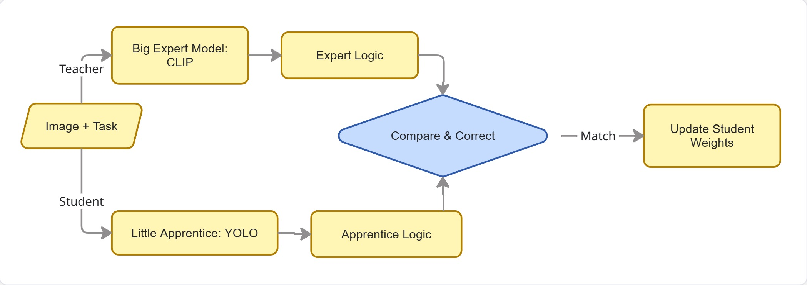

<link rel="stylesheet" href="./style.css"/>

# Task-Aware Object Detection for Resource-Constrained Edge Devices

**Project Goal:** To implement a lightweight, task-driven object detection pipeline on the VEGA Processor (FPGA) using the COCO dataset and 14 predefined tasks, optimizing for accuracy, latency, and power consumption.

---

## 1. System Overview
The baseline system is designed as a **Dual-Encoder Cross-Modal Pipeline**. It processes two distinct inputs—a visual stream (image) and a semantic stream (text task)—and fuses them to produce a task-specific detection.

## 2. Core Components

### A. The Visual Encoder (YOLOv8 Backbone)
*   **Role:** Extracts spatial and textural features from the input image.
*   **Mechanism:** Uses the CSPDarknet53 architecture. As the image passes through the convolutional layers, it is transformed into a **Feature Map ($F_{img}$)**.
*   **Output:** A multi-scale tensor representing the "visual essence" of the scene (edges, shapes, and object parts).

### B. The Text Encoder (Semantic Embedding)
*   **Role:** Converts the natural language task (e.g., "Find something to sit on") into a numerical format the computer can understand.
*   **Mechanism:** A lightweight Transformer-based encoder (typically a distilled version of **CLIP** or **DistilBERT**).
*   **Output:** A **Task Embedding Vector ($V_{task}$)**. This vector lives in a "semantic space" where the word "chair" and the word "sitting" are mathematically close to each other.

### C. The Fusion Layer (Cross-Modal Attention Fusion - CMAF)
*   **Role:** To "highlight" parts of the image that are relevant to the text task.
*   **Mechanism:** **Attention Mechanism.** The system calculates the relationship between every pixel in the feature map and the task vector.
    *   **Query ($Q$):** Derived from the Task Embedding.
    *   **Key ($K$):** Derived from the Image Feature Map.
    *   **Value ($V$):** The original visual data.
*   **Result:** A "weighted" feature map where irrelevant objects (like a cat when the task is "sitting") are mathematically suppressed, and relevant objects (like a chair) are amplified. ****doubtful about implementing this, cuz multiplication will be heavy on fpga****

### D. The Detection Head
*   **Role:** To draw the final bounding box.
*   **Mechanism:** A regression layer that takes the fused features and predicts coordinates $(x, y, w, h)$ and a "Task-Relevance Score."

---

## 3. Hardware Optimization

### Fixed-Integer Quantization (INT8)
The VEGA Processor and Genesys-2 FPGA are optimized for **Fixed-Point Arithmetic** rather than Floating-Point.
*   **The Baseline Requirement:** The model weights ($W$) and activations must be converted from 32-bit Decimals (Float32) to 8-bit Integers (INT8).
*   **Implementation:** This involves a **Scaling Factor**. For example, a decimal weight of `0.007` might be represented as the integer `2`. 
*   **Why it's required:** Standard FPGAs lack the complex circuitry to do fast decimal math. Integer math is significantly faster and uses 4x less memory and power.

---

## 4. Inference Workflow (Summary)
1.  **Input:** User provides an Image ($I$) and a Task ($T$).
2.  **Encoding:** Image goes through YOLO; Task goes through Text-Encoder.
3.  **Fusion:** The Attention layer "masks" the image based on the Task.
4.  **Quantization:** All math is performed using Fixed-Integer logic on the VEGA Processor.
5.  **Output:** The system identifies the coordinates of the most appropriate object.

---
## Idea 1: Task-Conditional Dynamic Sparsity (Gating)

### 1.1 Description
This approach focuses on **Computational Efficiency**. Conventional models run the entire network architecture regardless of the task. Dynamic Sparsity introduces a "Gating Mechanism" that uses the task prompt to identify and "switch off" irrelevant feature channels in the YOLO backbone at runtime. 
*   **The Innovation:** Instead of static pruning (permanent removal of weights), we use **Runtime Gating**. If the task is "Cutting," the model suppresses features related to "soft textures" or "organic shapes," focusing only on "metallic/sharp" features. This reduces the number of active multiplications, directly benefiting the FPGA's power profile.

### 1.2 Existing Literature & Similar Works
*   **Gated Linear Units (GLU):** *Dauphin et al., "Language Modeling with Gated Convolutional Networks" (2017)*. Introduced the concept of using one neural path to gate another.
*   **Dynamic Channel Pruning:** *Gao et al., "Dynamic Channel Pruning: Feature-Aware Optimization for Efficient Model Inference" (2018)*. Focuses on skipping channels based on input images. ****couldnt find the paper****
*   **Task-Aware Feature Modification:** *Li et al., "Task-Aware Feature Generation for Zero-Shot Object Detection" (2020)*. Uses task information to modify how features are processed. ****paper name wrong, inspect****

### 1.3 State-of-the-Art (SOTA)
*   **SOTA in Dynamic Networks:** *Han et al., "Dynamic Neural Networks: A Survey" (2021)*. This is the comprehensive guide to networks that change their structure based on input.
*   **SOTA in Hardware Gating:** *Wang et al., "SkipNet: Learning Dynamic Routing in Convolutional Networks" (2018)*. Focuses on skipping entire layers to save energy on mobile hardware.

---

## Idea 2: Semantic Affordance Knowledge Distillation (KD)

### 2.1 Description
This approach focuses on **Intelligence and Reasoning**. Small models like YOLOv8 often lack the "common sense" to know which object fits a complex task (e.g., "What should I use to fix a hole?"). 
*   **The Innovation:** We use a "Teacher" model (a large Vision-Language Model like CLIP) to teach the "Student" (YOLOv8) the **Functional Affordances** of objects. 
*   **The Process:** During training, the Teacher provides a high-dimensional semantic map of the image based on the task. The Student is trained to minimize the "hint loss"—trying to match the Teacher's sophisticated reasoning. Post-training, the Teacher is discarded, leaving a small model with "distilled intelligence."

### 2.2 Existing Literature & Similar Works
*   **Foundational KD:** *Hinton et al., "Distilling the Knowledge in a Neural Network" (2015)*. The original paper on transferring knowledge between models.
*   **Detection-Specific KD:** *Juneja et al., "Knowledge Distillation for Object Detection" (2019)*. One of the first to apply KD specifically to bounding boxes and class features.
*   **Visual Affordance:** *Myers et al., "Affordance Detection of Tool Use from Simple Geometric Features" (2015)*. Early work on identifying objects by what they *do* rather than what they *are*.

### 2.3 State-of-the-Art (SOTA)
*   **SOTA in Open-Vocabulary Detection:** *Gu et al., "ViLD: Open-vocabulary Object Detection via Vision and Language Knowledge Distillation" (ICLR 2022)*. This is the gold standard for using CLIP to teach a detector how to find objects based on text.
*   **SOTA in Task-Driven Vision:** *Zeng et al., "Socratic Models: Composing Zero-Shot Multimodal Reasoning" (2022)*. Uses LLMs to provide the "reasoning" that vision models lack.

---

## Summary Comparison for Proposal

| Feature | Idea 1: Dynamic Gating | Idea 2: Semantic Distillation |
| :--- | :--- | :--- |
| **Primary Goal** | Power & Latency Optimization | Accuracy & Reasoning Optimization |
| **CS Novelty** | Conditional Computation / Gating | Cross-Modal Knowledge Transfer |
| **FPGA Benefit** | Lower switching activity (Power) | Smaller model size with higher IQ |
| **Risk** | Harder to implement in RTL/Hardware | Requires more complex training setup |

---

# Mathematical Framework for Proposed Novelties

## Idea 1: Task-Conditional Dynamic Sparsity (Gating)

This novelty modifies the **Baseline YOLO Layer** to become "Context-Aware" by applying a multiplicative mask derived from the task text.

### 1.1 The Mathematical Expression
The output of a specific convolutional layer $l$ in your gated model is defined as:

$$Y_l = \sigma\left( \mathcal{G}(Z_{task}; W_g) \right) \odot f(X_{l-1}; W_l)$$

### 1.2 Symbol Meanings
*   $X_{l-1}$: The input feature map from the previous layer (Visual data).
*   $W_l$: The learned weights of the current YOLO layer.
*   $f(\cdot)$: The standard convolution operation.
*   $Z_{task}$: The **Task Embedding** generated by the Text Encoder.
*   $\mathcal{G}(\cdot)$: The **Gating Network** (a small 2-layer MLP).
*   $W_g$: The weights of the Gating Network.
*   $\sigma$: The **Sigmoid Activation Function**, ensuring the gate values are in the range $[0, 1]$.
*   $\odot$: The **Hadamard Product** (Element-wise multiplication).
*   $Y_l$: The resulting "Task-Filtered" feature map.

### 1.3 Step-by-Step Generation
1.  **Semantic Projection:** The task vector $Z_{task}$ is passed through $\mathcal{G}$ to calculate which visual "concepts" are relevant.
2.  **Gate Generation:** A vector of coefficients (the gates) is generated. A value near `1` means "keep this feature," and near `0` means "discard."
3.  **Active Filtering:** The image features are multiplied by these coefficients. Irrelevant visual noise (like background or non-task objects) is mathematically zeroed out.

### 1.4 Training Method: Sparsity-Inducing Loss
To force the model to actually "turn off" neurons (to save power), we add a **Sparsity Penalty** to the training loss:
$$L_{total} = L_{detection} + \lambda \sum |\sigma(\mathcal{G}(Z_{task}))|$$
*   **Reasoning:** The $L_1$ regularization ($\lambda$ term) rewards the model for making the gates as close to zero as possible without losing detection accuracy.

---

## Idea 2: Semantic Affordance Knowledge Distillation (KD)

This novelty transfers "Functional Reasoning" from a Large Teacher (CLIP) to the Small Student (YOLO) without increasing the Student's hardware footprint.

### 2.1 The Mathematical Expression
The training objective is to minimize the distance between the Teacher’s high-level understanding and the Student’s output:

$$L_{KD} = \text{MSE}\left( \Phi_{T}(I, T) , \mathcal{P}(\Phi_{S}(I, T)) \right)$$

### 2.2 Symbol Meanings
*   $\Phi_{T}(I, T)$: The **Teacher’s Feature Map**. This is the "gold standard" reasoning for an image $I$ and task $T$.
*   $\Phi_{S}(I, T)$: The **Student’s Feature Map** (from your YOLO model).
*   $\text{MSE}$: **Mean Squared Error**, calculating the average squared difference between the two brains.
*   $\mathcal{P}$: A **Projection Layer**. Since the Teacher is "bigger," its feature map might be 1024-wide, while the Student is only 256-wide. $\mathcal{P}$ is a small matrix that resizes the Student's features to match the Teacher's for comparison.
*   $L_{KD}$: The Distillation Loss.

### 2.3 Step-by-Step Generation
1.  **Teacher Inference:** The heavy model (Teacher) processes the image and task. It identifies "Affordance regions" (e.g., it "sees" that a handle is for "gripping").
2.  **Student Inference:** The light model (Student) tries to do the same.
3.  **Alignment:** The Student's output is compared to the Teacher's.
4.  **Error Correction:** The Student’s weights are updated to mimic the Teacher’s internal representation.

### 2.4 Training Method: Multi-Task Learning
The model is trained using a composite loss function:
$$L_{final} = L_{YOLO} + \beta L_{KD}$$
*   **Phase 1 (Training):** Both models run. The Student learns from the Teacher.
*   **Phase 2 (Deployment):** The Teacher is removed. The Student now operates independently on the VEGA processor, but it retains the "reasoning" it learned during Phase 1.

---

## Hardware Constraint Note: The Integer Transformation

For both ideas, the variables ($W, Y, \Phi$) must eventually undergo **Quantization**:
$$Q(x) = \text{clamp}\left( \lfloor \frac{x}{S} \rceil + Z, -128, 127 \right)$$
*   **$S$ (Scale):** Determines how much "decimal" we keep.
*   **$Z$ (Zero-point):** Shifts the range to fit 8-bit integers.
*   **Constraint:** On the VEGA processor, the $\odot$ (multiplication) in the Gating idea will be performed as **Fixed-Point Multiplication**, which is essentially an integer multiply followed by a bit-shift.

---

### 1. The Difference: Attention vs. Gating

Think of them like this:
*   **Attention** is like a **Searchlight**. Every pixel in the image "looks" at every word in the task to see how they relate. It is very detailed but very expensive (Math: $O(N^2)$).
*   **Gating** is like a **Filter**. The task text creates a "Master Key" (the gate). This key is applied to the whole image at once to turn specific feature channels on or off. It is much faster (Math: $O(N)$).

**Is gating based on attention?**
Technically, yes. Gating is often called **"Global Cross-Attention."** Instead of every pixel looking at every word individually, the *entire image* looks at the *entire task* once.

---

### 2. The FPGA Problem: Why "Full Attention" is Heavy

In the **Baseline** I described earlier, I mentioned "Attention Fusion." However, on a Genesys-2 FPGA/VEGA processor:
1.  **Memory Bottleneck:** Standard Attention requires a "Similarity Matrix" ($QK^T$). If your image has 10,000 "patches," that matrix is $10,000 \times 10,000$. This will crash the FPGA's on-chip memory (BRAM).
2.  **Softmax Difficulty:** Attention requires the **Softmax** function ($e^x$). Calculating exponents on a Fixed-Integer processor is extremely slow and inaccurate.

---

### 3. The "Gating" Solution: Making it FPGA-Friendly

This is why **Idea 1 (Gating)** is actually your **Novelty**. You are taking the "Heavy Attention" required for task-awareness and replacing it with **"Lightweight Channel Gating."**

#### How the Math changes to save the FPGA:

**Instead of Full Attention:**
$$\text{Output} = \text{Softmax}(Q \cdot K^T) \cdot V \quad \leftarrow \text{[Too heavy for VEGA]}$$

**You use Task-Gating:**
$$\text{Output} = \text{Gate}(\text{Task}) \odot \text{Features}(\text{Image}) \quad \leftarrow \text{[Perfect for VEGA]}$$

*   **Why it's better:** You only do **one multiplication** per feature channel.
*   **Why it's still "Attention":** It's still focusing on what's important, but it's doing it at the **Channel Level** instead of the **Pixel Level**.

---

# Detailed Project Methodology

## Phase 1: Preparation (Setting the Foundation)

**1. Task Semantic Mapping**
*   **What is happening:** We take the 14 tasks (like "Cutting" or "Pouring") and turn them into "Brain Language." 
*   **How to do it:** We feed each task into a tiny pre-trained Language Model (like DistilBERT). This creates 14 "Task Vectors." Think of these as a unique 128-digit code for each task.
*   **Why:** Instead of searching for a word, the computer is now searching for a mathematical concept.

**2. Dataset "Cleaning"**
*   **What is happening:** We filter the COCO dataset to focus on images that match our 14 tasks.
*   **How to do it:** We create a "Golden Table" that maps tasks to objects (e.g., Task: "Drink" -> Objects: "Cup," "Bottle," "Glass").

---

## Phase 2: The Architecture (Baseline + Novelty 1: Gating)

This diagram shows how the Image and Text meet in the middle.

<!--  -->
 

**Step-by-Step Logic:**
1.  **The Visual Path:** The image goes through the YOLO backbone (the "Eyes"). It identifies colors, textures, and shapes.
2.  **The Semantic Path:** The Task Vector goes through a "Gating MLP" (a few small math layers). This generates a set of **Multipliers** (between 0 and 1).
3.  **The Interaction:** These multipliers act like **Volume Knobs** on the visual features.
    *   *Example:* If the task is "Sitting," the "Knob" for "Furniture features" is turned to 100%, and the "Knob" for "Animal features" is turned to 0%.
4.  **The Final Decision:** The Detection Head only sees the amplified "relevant" features, making its job much easier and more accurate.

---

## Phase 3: The Training  (Novelty 2: Distillation)

This happens **only on your PC**, not on the FPGA. This is how we make the model "smart."

**Step-by-Step Logic:**
1.  **The Expert (Teacher):** We use a giant model (CLIP) that already knows everything. We ask it: "What in this image is best for this task?"
2.  **The Apprentice (Student):** We ask your YOLO model the same thing.
3.  **The Correction:** If the Apprentice is wrong, we calculate the difference (Loss) and force the Apprentice to change its "brain" to match the Expert.
4.  **Graduation:** Once the Apprentice (YOLO) can predict as well as the Expert, we "delete" the Expert. The Apprentice is now "Smart" but still "Small."

---

## Phase 4: Hardware Bridge 

Now we prepare the model for the **VEGA Processor**.

**1. Fake Quantization (Simulation)**
*   **What:** We tell the model: "Pretend you can only use whole numbers (integers)."
*   **How:** During the last few rounds of training, we round off all the decimals. If the model's accuracy drops, it learns to adjust its weights to work better with whole numbers.

**2. Bit-Shift Optimization**
*   **What:** In the Gating layer, instead of multiplying by `0.5`, we tell the computer to "Shift the bits to the right by 1."
*   **How:** We design the math so that our "Gating Knobs" are always powers of two (1, 0.5, 0.25). Bit-shifting is the fastest possible operation on an FPGA.

---

## Phase 5: Final Deployment (On the Genesys-2 Board)

**1. Exporting:** We save the model as a list of integers.
**2. Loading:** The ECE team loads these integers into the VEGA processor's memory.
**3. Real-Time Check:** 
   *   The camera sees a scene.
   *   The user types a task.
   *   The VEGA processor does the "Bit-Shifts" and "Integer Math."
   *   A box appears around the correct object in milliseconds.

---