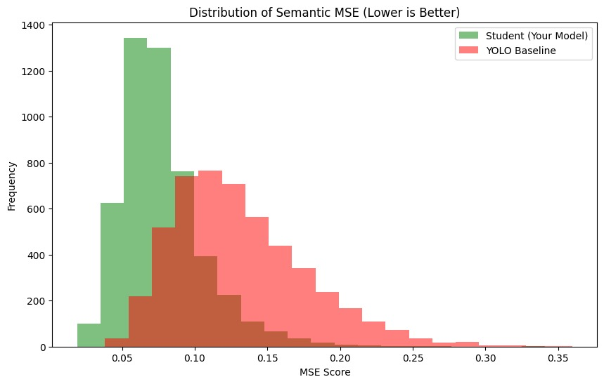
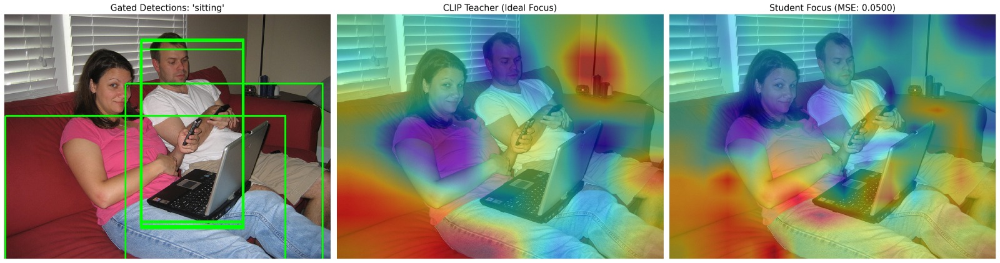
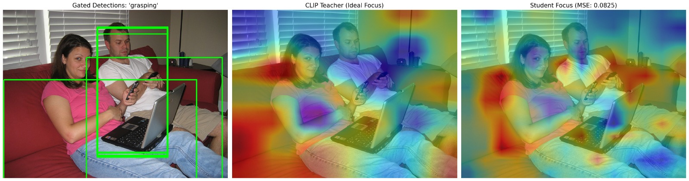
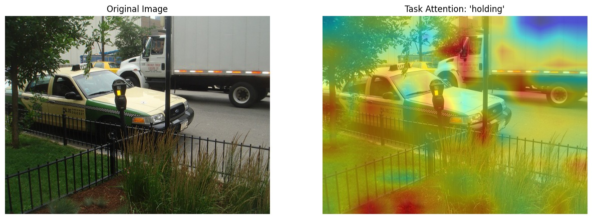
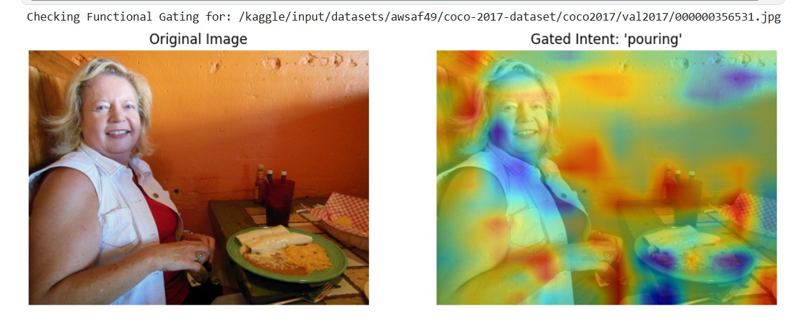
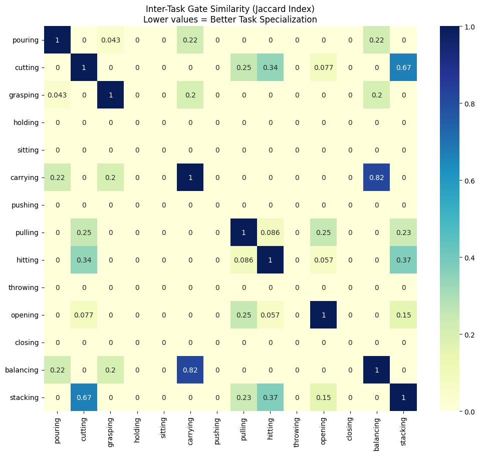
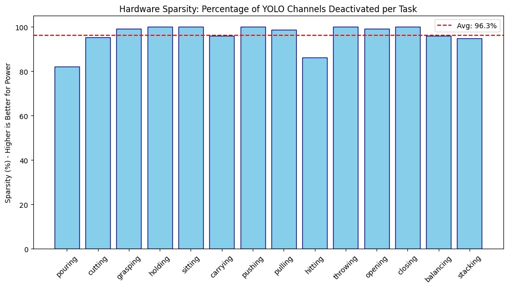
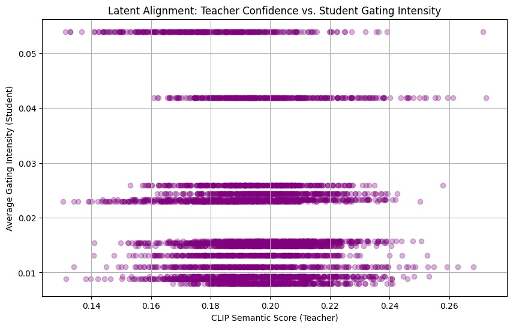

<!-- Slide 1: Title -->
<!-- _class: lead -->
<!-- # IDP Phase 1 Presentation -->
# Task Based Object Detection
## With Semantic Distillation and Dynamic Gating using Accelerator on FPGA for Embedded Applications
***An Assistive Vision Framework for Inclusive Education and Interactive Learning Analysis.***
**Team Members:**
Ackshaya Keerthi G 1RV23CS013
Bhoomika Sundar 1RV23CS066
Tandle Suhani 1RV23EC164
Vaibhavi D 1RV23EC177

**Guide:**
Dr. Roopa.T.S, Assistant Professor, Dept of Mechanical Engineering
**R V College of Engineering**

---

# 11. Phase 2 Results: Semantic Alignment
**Objective:** Evaluate if the distilled Student (YOLOv8) successfully mirrors the Teacher's (CLIP) reasoning.

### MSE Metric
$$MSE = \frac{1}{M \times N} \sum_{i=1}^{M} \sum_{j=1}^{N} (Y_{i,j} - \hat{Y}_{i,j})^2$$

* **Reduction:** Achieved a **40.93% improvement** in alignment.
* **Result:** Error dropped from 0.1343 to **0.0710**.
* **Inference:** The student has learned to focus features on task-relevant areas.

| Configuration | MSE | Improvement |
| :--- | :--- | :--- |
| Standard YOLOv8 | 0.1343 | -- |
| **Task-Aware Student** | **0.0710** | **40.93%** |

---

# 12. Statistical Distribution of Alignment Error
Analyzing the reliability of the task-aware gating mechanism across 5,000 samples.

### Distribution Metrics
$$\sigma = \sqrt{\frac{1}{N} \sum_{i=1}^{N} (MSE_i - \mu)^2}$$

* **Left-Shifted Peak:** Indicates high semantic alignment for the vast majority of images.
* **Lower $\sigma$:** Proves the assistive feedback remains stable across diverse environments.
* **Robustness:** Minimizes "outlier" frames where focus might drift.

*Fig 5: Probability Density Distribution of MSE*

---
# 13. Qualitative Results: Affordance Mapping
Visualizing how the model prioritizes **Function** over **Label**.

### Spatial Alignment Score ($S$)
$$S = \frac{\sum (H_T - \bar{H}_T)(H_S - \bar{H}_S)}{\sqrt{\sum (H_T - \bar{H}_T)^2 \sum (H_S - \bar{H}_S)^2}}$$

* **'Sitting':** Focuses activations on **horizontal support surfaces** rather than just the chair frame.
* **'Grasping':** Concentrates on **edges and handles** for fine-grained interaction.

*Fig 6: Task-Aware Localization*

---

*Fig 6: Spatial Alignment of Task-Aware Heatmaps*

---

# 14. Hardware Evaluation: Gating Sparsity
**Target Platform:** CDAC VEGA RISC-V (Resource Constrained)

$$S_c = \left( 1 - \frac{\sum_{i=1}^{C} \mathbb{1}(g_i > \tau)}{C} \right) \times 100$$

| Hardware Metric | Achieved Value |
| :--- | :--- |
| **Average Channel Sparsity ($S_c$)** | **96.29%** |
| Active Computational Channels | 9.47 / 256 |
| **Theoretical Computational Reduction** | **96.30%** |
| **Estimated Power Saving (VEGA)** | **77.04%** |

**Inference:** 96.3% of multipliers in the P5 layer remain idle, enabling extreme power optimization.

---

# 15. Task-Specific Suppression & Specialization
Analyzing the "Digital Signature" and inter-task architectural overlap.

### Jaccard Similarity Index ($J$)
$$J(T_1, T_2) = \frac{|\mathbf{G}_{T_1} \cap \mathbf{G}_{T_2}|}{|\mathbf{G}_{T_1} \cup \mathbf{G}_{T_2}|}$$

* **Mean Overlap:** Only **1.85%**.
* **Pearson Correlation:** $\rho = -0.1298$.
* **Hardware Benefit:** Deterministic mapping allows pre-loading masks into BRAM.

*Fig 7: Inter-task Gate Similarity Matrix*

---

# 14. Task-Specific Suppression & Correlation
Analyzing the Suppression of channels of various assistive tasks.

* **Channel Suppression:** Consistent high deactivation across all 14 task categories.
* **Deterministic Mapping:** Correlation ($\rho = -0.1298$) shows the model learned image-invariant mappings.
* **Hardware Benefit:** Static task-specific masks can be pre-loaded into BRAM, bypassing real-time MLP math.

*Fig 8 : Sparsity per task

*Fig 9: Correlation Analysis*

---

# 16. Performance Comparison & Integrity
Evaluating functional parity and software overhead.

### Functional Parity ($P_f$)
$$P_f = \frac{1}{N} \sum_{i=1}^{N} \mathbb{1}(\text{IoU}(\mathbf{B}_{dense}, \mathbf{B}_{sparse}) > \lambda)$$

* **Consistency:** **100%**.
* **Software Overhead ($\Omega$):** **11.65%**.
* **Latency:** $L = T_{backbone} + T_{task\_mapper} + T_{gating}$

| Metric | Baseline | Task-Aware |
| :--- | :--- | :--- |
| Mean Latency (ms) | 8.17 | 9.12 |
| **Object Retention** | 100% | **100%** |
| **Recall Stability** | 100% | **100%** |

---

# 16. Inferences Drawn (Phase 2)

1. **Distillation Success:** Knowledge Distillation effectively transfers "Expert" reasoning into a $O(C)$ gating mechanism.
2. **Structural Redundancy:** Standard backbones are highly redundant; **96.29%** of filters can be bypassed for specific intents.
3. **Hardware Readiness:** The system is optimized for **CDAC VEGA** via deterministic gating, facilitating real-time assistive guidance.
4. **Dual-Stream Safety:** The architecture maintains a **Dense Stream** for obstacle detection and a **Sparse Stream** for semantic reasoning.

> **Conclusion:** The Task-Aware framework is a viable, low-power solution for intent-driven scene understanding in inclusive educational settings.

---

<!-- _class: lead -->
# Thank You