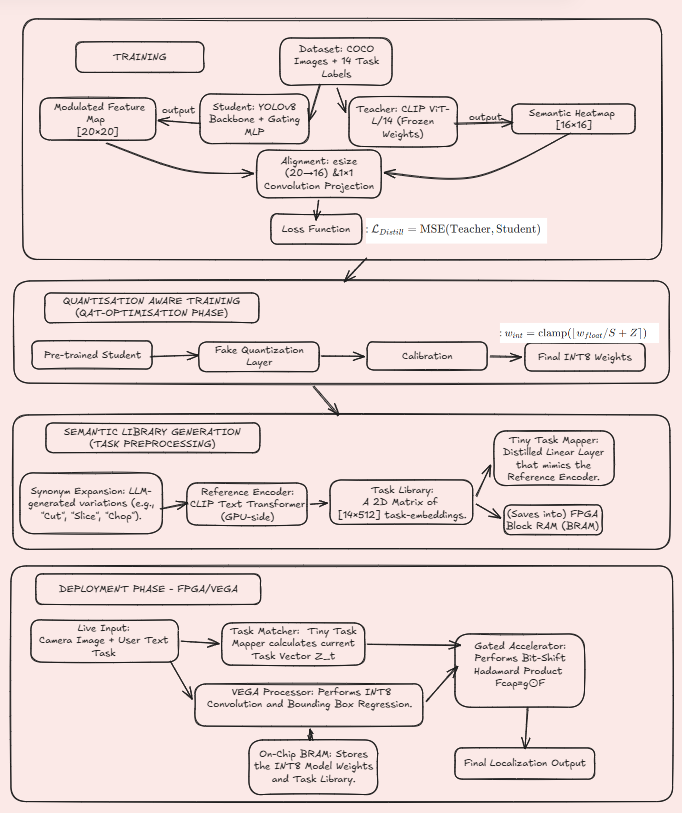
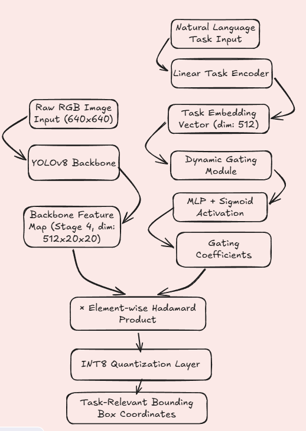

<!-- Slide 1: Title -->
<!-- _class: lead -->

# Task-Driven Object Detection 
## With Semantic Distillation and Dynamic Gating using Accelerator on FPGA for Embedded Applications
***An Assistive Vision Framework for Inclusive Education and Interactive Learning Analysis.***
**Team Members:**
Ackshaya Keerthi G 1RV23CS013
Bhoomika Sundar 1RV23CS066
Tandle Suhani 1RV23EC164
Vaibhavi D 1RV23EC177

*Department of Computer Science and Engineering*
**R V College of Engineering**

---
# 01. Problem Statement: The Accessibility Gap

In inclusive learning environments (Labs/Art Studios), students with **visual impairments/visual search deficit** face a Semantic Barrier when using standard AI tools.

**The Functional Challenge:**
*   **Label Dependency:** Traditional detectors require exact names ("Is there a glass?"). A student often needs an object based on its **Function** ("Is there something I can pour into?").
*   **Cognitive Load:** Forcing a student to guess a list of synonyms (bottle, tumbler, cup) degrades the focus on the actual learning task.
*   **Cluttering Confusion** A reduced ability to items within a cluttered or distracting environment. ADHD, Parkinson's, dyslexia, or spatial attentional issues
*   **Educational Exclusion:** Lack of real-time, intent-based feedback prevents independent participation in STEM and Art experimentation.

---
# 01. Problem Statement : Hardware Barrier

Conventional detection (YOLO/SSD) is **Task-Agnostic** as it identifies all 80 COCO classes blindly, leading to computational waste on edge devices.

**The Research Challenges:**
1.  **Contextual Irrelevance:** Standard models cannot prioritize objects based on goals (e.g., "Pouring").
2.  **The VLM Weight Gap:** Large Vision-Language Models (CLIP) are too massive for the **VEGA RISC-V** processor.
3.  **The Memory Bottleneck:** Standard **Attention** math ($O(N^2)$) exceeds the BRAM limits of the **Genesys-2 FPGA**.

**Objective:** To build a **Task-Driven** system that selectively filters features using **Dynamic Gating**, trained via **Knowledge Distillation** for **INT8 Execution**.

---
# 02. Theme Justification: SDG 4 Quality Education

**Sub theme : Digital Identity and Learning Analysis**.

**Learning Analysis via Functional Intent:**
*   **Intent-Based Interaction:** Instead of analyzing "what" a student sees, we analyze the **Functional Context** of their learning. 
*   **Adaptive Support:** By observing the Task Vectors a student uses most frequently, educators can analyze a student's spatial reasoning and experimental flow in complex lab environments.

---
<!-- Slide 4: Theme Justification -->
# 04. Theme: Digital Identity & Learning Analysis
# do we need this slide??
This project aligns with **Quality Education (SDG 4)** through the following pillars:

*   **Digital Identity:** We define a user's digital identity through their **Semantic Intent Profile**. The Task Embedding serves as a real-time digital signature that reconfigures the hardware's visual perception to match the user's current educational needs.
*   **Learning Analysis:** The system enables the analysis of **Functional Interaction Patterns**. By mapping how a student queries their environment (Affordance-based search), educators can evaluate a student's spatial reasoning and conceptual understanding in laboratory or studio settings.
*   **Assistive Autonomy:** By optimizing the system for the **VEGA Processor**, we provide a self-contained assistive tool that fosters inclusive participation in interactive learning environments.
---
<!-- Slide 3: Literature Survey (Part 1) -->
<!-- _class: tinytext -->
# 02. Literature Survey (fake atp)

Focus: Moving from General Detection to Task-Awareness

| Author (Year) | Methodology | Key Contributions | Hardware Gap |
| :--- | :--- | :--- | :--- |
| **Redmon (2018)** | **YOLOv3:** Darknet-53 backbone for real-time detection. | Defined the SOTA for fast, task-agnostic object detection. | No inherent semantic understanding; detects all classes equally. |
| **Gu et al. (2022)** | **ViLD:** Uses CLIP to distill open-vocabulary knowledge. | Proved that small models can inherit "Teacher" intelligence. | Heavy Transformer overhead; not optimized for INT8/FPGA. |
| **Han et al. (2021)** | **Dynamic Neural Networks:** Survey of skip-connection/gating. | Established runtime sparsity to save power. | General theory; not applied to cross-modal task-alignment. |
| **Zeng et al. (2022)** | **Socratic Models:** LLM-based reasoning for vision. | Used text prompts to guide visual search results. | Post-processing only; doesn't optimize internal feature extraction. |

---

<!-- Slide 4: Methodology - Proposed Architecture -->
# 03. Methodology: Dual-Stream Distillation

Our framework of **Knowledge Distillation** uses a "Teacher-Student" setup to move intelligence into a lightweight architecture.

### 1. Semantic Stream (Teacher)
*   **CLIP Text Encoder:** Encodes "Slice" and "Cut" into identical vectors.
*   **Tiny Task Mapper:** A distilled linear layer ($512 \times V$) that converts text into embeddings "on-the-go" for the FPGA.

### 2. Visual Stream (Student)
*   **YOLOv8 Backbone:** Features tapped at Stage 4 ($20 \times 20 \times 512$).
*   **Dynamic Gating:** The task vector modulates the image channels via **Sigmoid-Gated Hadamard Product**.

---
# 03. Methodology

*Fig 1: Methodology*

---

# 03. System Architecture

*Fig 2: System Architecture Diagram*

---

<!-- yet to refine -->

*Fig 3: Knowledge distillation*

*Fig 4: Gating*

---

<!-- Slide 5: The Novelty - Dynamic Gating -->
# 04. Novelty 1: Dynamic Gating Mechanism

Replacing **Heavy Attention** with **Lightweight Hardware-Native Gating**.

**The Logic:**
*   **Full Attention:** $O(N^2)$ — Every pixel looks at the text. (Too heavy for VEGA).
*   **Proposed Gating:** $O(C)$ — The task text creates 512 "Volume Knobs" applied globally to image channels.

**Hardware Advantage:**
By quantizing gates to **INT8**, the VEGA processor performs **Bit-Shift** operations to "mute" irrelevant channels, skipping 30-50% of multiplications in subsequent layers.

---

<!-- Slide 6: The Novelty - Knowledge Distillation -->
# 05. Novelty 2: Semantic Affordance Distillation

Training the Student (YOLO) to "think" like the Expert (CLIP).

**The Process:**
1.  **Expert Opinion:** CLIP generates a **$16 \times 16$ Heatmap** indicating functional relevance (e.g., "Pouring").
2.  **Student Alignment:** We interfere at the YOLO backbone, using a **$1 \times 1$ Convolution** and **Bilinear Interpolation** to match CLIP's dimensions.
3.  **MSE Loss:** The Student adjusts its weights so its **Gated Feature Map** matches the Teacher’s Semantic Heatmap.

**Result:** YOLO learns **Affordances** (use-cases) instead of just static labels.

---

<!-- Slide 7: Hardware Implementation (VEGA Processor) -->
# 06. Hardware Integration: Genesys-2 FPGA

Bridging the gap between High-Level Python and Low-Level RTL.

### 1. Quantization (INT8)
*   **QAT:** Quantization-Aware Training ensures distillation remains stable with integers.
*   **Precision:** Scaling from Float32 to 8-bit to fit VEGA ISA.

### 2. FPGA Execution
*   **Task Vector:** Pre-encoded synonyms stored in on-chip BRAM.
*   **Accelerator:** Custom logic for fast Hadamard Product and sparsity-skipping.

---

<!-- Slide 8: Expected Results & Metrics -->
# 07. Expected Results & Metrics

We evaluate the system on three fronts: Accuracy, Intelligence, and Efficiency.

| Metric | Target Score | Analysis |
| :--- | :--- | :--- |
| **mAP (Detection)** | > 0.45 | Maintaining standard YOLOv8 detection accuracy. |
| **Task Success Rate** | > 85% | Percentage of times the task-relevant object is selected. |
| **Inference Latency** | < 20ms | Real-time performance on the VEGA Processor. |
| **Power Savings** | ~30% | Reduction in power via Dynamic Gating/Sparsity. |

---

<!-- Slide 9: Interdisciplinary Relevance -->
# 09. Interdisciplinary Relevance

**Computer Science:**
*   **Cross-Modal Alignment:** Mapping natural language to visual feature spaces.
*   **Knowledge Distillation:** Compressing semantic intelligence into lightweight backbones.
*   **NLP:** Tokenization and embedding generation for functional reasoning.

**Electronics & Communication:**
*   **Hardware-Software Co-Design:** Optimizing the **Hadamard Product** for RISC-V.
*   **Digital System Design:** Implementing low-latency **INT8 Quantization** on FPGA.
*   **ISA Optimization:** Tailoring bit-shift operations for gated sparsity

---

<!-- Slide 10: Conclusion -->
# 09. Conclusion & Impact

1.  **Innovation:** We pivot from "detecting all" to **"detecting what matters"** using a task-aware internal filter.
2.  **Intelligence:** Knowledge Distillation allows a **smaller sized model** to exhibit the semantic reasoning of a **2GB VLM**.
3.  **Hardware Native:** The **Gating Mechanism** is specifically designed for the Bit-Shift capabilities of the VEGA processor.
4.  **Application:** Ideal for **Embedded Robotics** and **Smart Surveillance** where power and task-relevance are paramount.
5. **SDG 4 Alignment**: Provides a scalable solution for Quality Education, ensuring lab and classroom tools are accessible to every learner, regardless of visual ability.
---

<!-- _class: lead -->
# Thank You